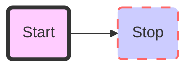

## Color 色彩

为保持视觉传达一致，UI为框架定制一套调色板

## 主色

mermaid
graph LR
    id1(Start)-->id2(Stop)
    style id1 fill:#f9f,stroke:#333,stroke-width:4px,fill-opacity:0.5
    style id2 fill:#ccf,stroke:#f66,stroke-width:2px,stroke-dasharray: 10,5
